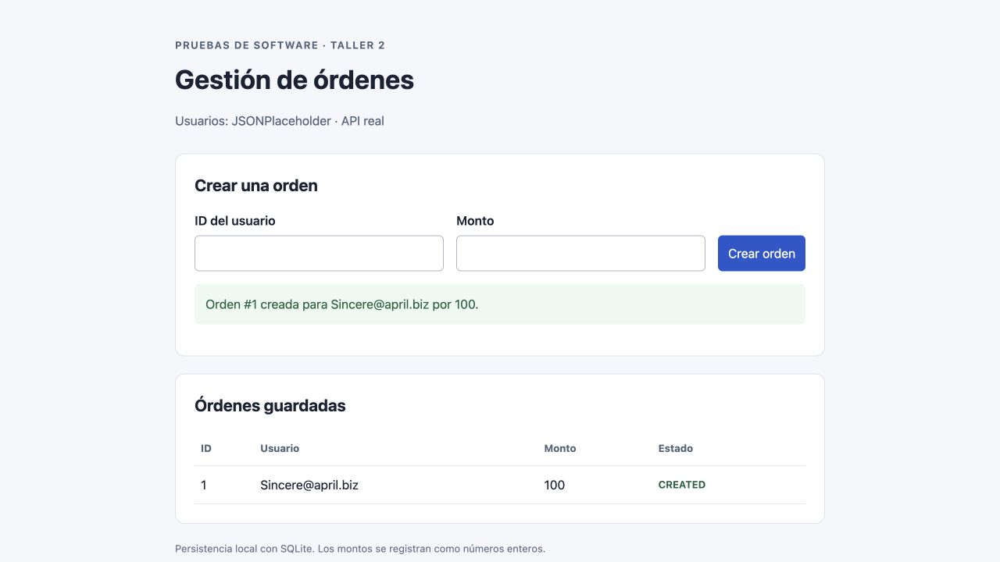
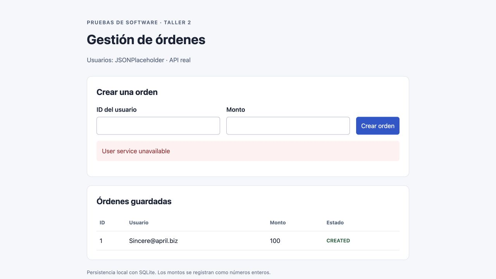
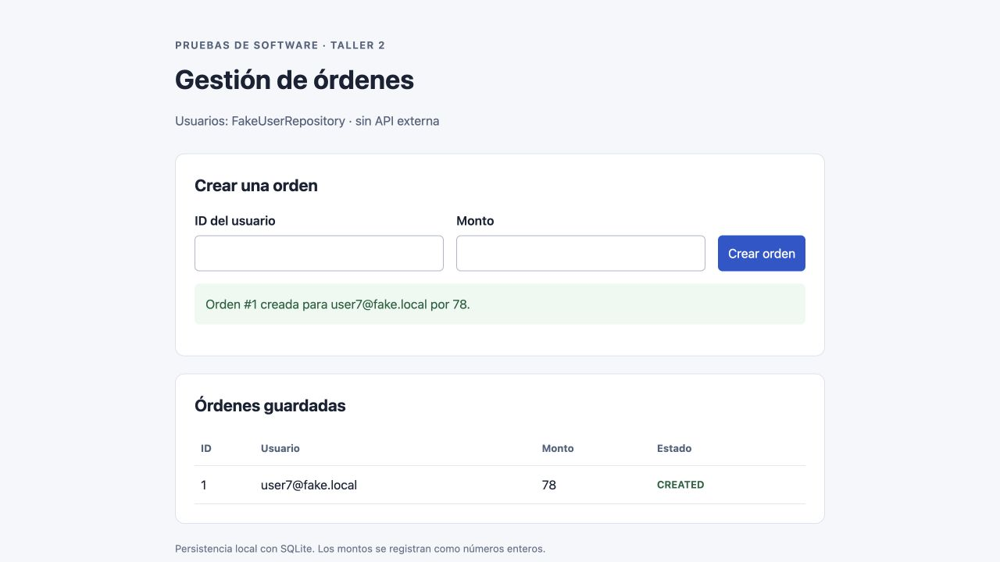

# Taller 2 de Pruebas de Software

Mateo Lopera Ortiz · 23 de septiembre de 2026

Se completó la aplicación de órdenes y se comprobaron los escenarios de los pasos 0 a 10. Las pruebas que usan JSONPlaceholder pasan cuando la API responde y fallan al simular su indisponibilidad. Las 18 pruebas locales pasan aun con esa falla activada. La diferencia entre una prueba unitaria y una de integración depende de las dependencias que se ejecutan, no del nombre del archivo.

Repositorio: [Mateoloperaortiz/taller-2-pruebas-software](https://github.com/Mateoloperaortiz/taller-2-pruebas-software).

## Paso 0 Preparación del entorno

Se creó un entorno virtual con Python 3.11.16 y se instalaron Flask, SQLAlchemy, requests y pytest con las versiones fijadas en `requirements.txt`. Faker no se necesita: el Fake solicitado genera el correo de forma determinista. El [README](../README.md) contiene los comandos de instalación, ejecución y reproducción de cada escenario.

La entrega conserva los nombres de los cuatro archivos de pruebas del taller. Se añadieron aislamiento de bases de datos, pruebas del formulario, evidencias y el workflow de GitHub Actions. El enlace del repositorio constituye la evidencia de este paso.

## Paso 1 Contexto de la aplicación

El formulario Flask llama a `create_order`. El servicio consulta un repositorio de usuarios, construye una entidad `Order`, la guarda con SQLAlchemy en SQLite y solicita una notificación. El repositorio real consulta JSONPlaceholder; el Fake calcula un correo ficticio. El notificador web imprime en consola y no envía correos.

**¿Qué parte del sistema no controlamos?** No controlamos la disponibilidad, latencia, datos ni contrato de JSONPlaceholder, ni toda la infraestructura de red entre la app y ese servicio. Sí controlamos cómo consultamos la API, el timeout y cómo manejamos sus errores. Tener acceso a internet no garantiza que la API responda correctamente.

## Paso 2 Persistencia con SQLite

`Order` contiene `id`, `user_email`, `amount` y `status`. Los datos se guardan después de `db.add(order)` y `db.commit()`. La aplicación conserva sus datos en `orders.db`; cada prueba de integración utiliza un archivo temporal independiente.

**¿Por qué la base de datos es una dependencia?** El servicio necesita que otro componente ejecute la persistencia. El motor, las conexiones, el esquema, las transacciones y el archivo pueden fallar aunque la regla de negocio sea correcta. SQLite sigue siendo una dependencia real aunque no requiera un servidor remoto. Inyectar la sesión permite reemplazarla en una prueba unitaria.

## Paso 3 Repositorio real de usuarios

Se implementó `JsonPlaceholderUserRepository.get_user_email`, con una petición GET, timeout de cinco segundos y `raise_for_status()`. La consulta a `/users/1` devolvió HTTP 200 y el correo `Sincere@april.biz`.

La [colección de Postman](../postman/Taller2.postman_collection.json) verificó el estado HTTP, el ID 1 y el email esperado: **3 verificaciones correctas**. Se ejecutó con Newman 6.2.1, el runner de colecciones de Postman; no se utilizó la interfaz gráfica de Postman. Se adjuntan la [salida real](../evidencias/paso03_postman.txt) y el [JSON recibido](../evidencias/paso03_usuario1.json).

**¿Quién garantiza que el usuario existe?** La respuesta del servicio externo confirma que ese usuario está disponible en el momento de la consulta. La aplicación local no garantiza su existencia permanente. Una respuesta 404, un timeout o un cambio de formato deben tratarse como fallas de la consulta. El Fake del taller tampoco demuestra que exista un usuario real.

## Paso 4 Lógica de negocio

Se completó `create_order`: valida un monto positivo, obtiene el correo, registra la operación, construye la orden con estado `CREATED`, la agrega a la sesión, confirma la transacción y notifica. Los montos cero o negativos producen `ValueError("Invalid amount")`.

La validación del monto se realiza antes de consultar la API para evitar una petición innecesaria cuando la entrada ya es inválida. El repositorio, la sesión, el logger y el notificador llegan como parámetros. Sus contratos mínimos están en `contracts.py`.

**¿La lógica sabe de dónde viene el usuario?** No. Solo necesita que el objeto recibido tenga el método `get_user_email(user_id)`. Puede recibir un repositorio HTTP, un Fake o un Stub sin cambiar la función. Esta inyección de dependencias permite aislar la lógica y probar escenarios distintos.

## Paso 5 Interfaz web funcional

Se ejecutó la app con `USER_REPOSITORY=real`. Desde el formulario se creó una orden para el usuario 1 por 100. La interfaz mostró `Sincere@april.biz` y `CREATED`. Después de detener Flask y arrancarlo de nuevo con el mismo archivo SQLite, la orden seguía visible. Una consulta independiente a SQLite confirmó la fila `(1, Sincere@april.biz, 100, CREATED)`.

La evidencia de persistencia incluye una [captura después del reinicio](../evidencias/paso05_persistencia_reinicio.png) y la [consulta a SQLite](../evidencias/paso05_sqlite.json). La aplicación captura los errores de la operación, revierte la sesión cuando corresponde y conserva las órdenes existentes.

## Paso 6 Pruebas con la API real

Se completaron `DummyLogger` y `NullNotifier` con métodos vacíos y se comprobó el estado `CREATED`. Son dobles para dependencias auxiliares; la API y SQLite siguen siendo reales. En ambos archivos se consultó el usuario 1.

| Archivo | Resultado | Dependencias reales |
| --- | --- | --- |
| test_unit_real_api.py | 1 passed | API y SQLite |
| test_integration_real_api.py | 1 passed | API y SQLite |

Salidas: [test llamado unitario](../evidencias/paso06_unit_real.txt) y [test de integración](../evidencias/paso06_integration_real.txt).

**¿Este test es siempre confiable? ¿Por qué?** No es determinista: puede fallar por red, timeout, indisponibilidad de la API o cambios de datos, sin que exista una regresión en `create_order`. Es útil para comprobar la comunicación real, pero una ejecución exitosa no garantiza disponibilidad futura. Las bases temporales eliminan contaminación entre pruebas, no la incertidumbre de la red.

**¿Cuál es la diferencia entre los dos archivos?** En la plantilla ambos abren una sesión real, consultan la API y comprueban el estado; conceptualmente los dos son integración. Cambiar el nombre o el monto no transforma uno en unitario. En esta solución, el archivo de integración además cierra la sesión de escritura y vuelve a leer la orden desde una sesión nueva para demostrar el commit. Se mantiene el nombre original del otro archivo por trazabilidad, con una aclaración en su encabezado.

## Paso 7 Falla de la dependencia externa

Se activó `SIMULATE_USER_API_FAILURE=1`. El método del repositorio real lanzó `ConnectionError("User service unavailable")` antes de intentar HTTP. Es el mismo error propuesto por el enunciado, activable sin borrar la implementación que funciona.

| Ejecución | Resultado observado | Código de salida |
| --- | --- | --- |
| test_unit_real_api.py | 1 failed | 1 esperado |
| test_integration_real_api.py | 1 failed | 1 esperado |
| Crear orden desde Flask | User service unavailable | Error mostrado en el formulario |

Las [salidas del primer test](../evidencias/paso07_unit_falla.txt) y del [segundo test](../evidencias/paso07_integration_falla.txt) conservan los fallos completos. Son evidencia del experimento; no se ocultan con `skip` ni `xfail`.

**¿Qué se rompió realmente?** Se rompió la obtención del usuario en el repositorio. No se modificó la regla del monto ni SQLite. Como no se obtiene el email, no se construye ni persiste una nueva orden y no se envía la notificación. La creación falla, pero el servidor puede seguir mostrando el formulario y las órdenes anteriores. “Todo falla” en el enunciado se refiere al flujo de creación dependiente de la API; no implica que el proceso Flask termine.

## Paso 8 Recuperación con un Fake

Se implementó `FakeUserRepository`, que calcula `user{user_id}@fake.local`, y la app quedó configurada para usarlo por defecto. Se creó desde el navegador una orden del usuario 7 por 78, con correo `user7@fake.local` y estado `CREATED`, manteniendo activa la falla del repositorio real.

El Fake reemplaza la consulta remota por una implementación simplificada y determinista. Permite probar el resto de la app sin la API, pero no valida el contrato HTTP, la existencia de usuarios reales ni la equivalencia de todos los errores del proveedor. La clase se importa desde un solo lugar; se eliminó la duplicación que aparecía en el test base.

## Paso 9 Prueba unitaria con Stub

`StubUserRepository` se define dentro del archivo del test y devuelve siempre `stub@example.test`. La sesión se reemplaza por `Mock(spec=OrderSession)`; el logger y el notificador se observan con mocks. Se comprueban el correo, el monto, el estado, la solicitud de guardado, el commit y la notificación.

Se añadieron casos para montos 0, -1 y -200, error del repositorio y error de commit. Los montos inválidos no consultan usuarios ni generan efectos secundarios. Una falla antes de guardar no notifica, y una falla de commit tampoco notifica. Resultado: **6 passed**, con la falla externa activada. [Salida del test unitario](../evidencias/paso09_stub.txt).

**¿Por qué este sí es un test unitario?** Ejecuta la lógica de `create_order` con dependencias controladas, sin HTTP, conexiones SQL ni archivos de BD. El objeto `Order` se instancia en memoria. El fixture de pruebas bloquea conexiones de red. Sustituir únicamente el repositorio manteniendo `SessionLocal`, como en la plantilla, habría dejado una integración con SQLite: por eso también se reemplazó la sesión.

## Paso 10 Integración sin API externa

Se integra `create_order` con el modelo, SQLAlchemy y SQLite real, usando el Fake para usuarios. Se crea una orden del usuario 3 por 60, se cierra la sesión y se recupera desde otra. Se comprueban correo `user3@fake.local`, monto 60 y estado `CREATED`. Otro caso verifica que el monto inválido no deja registros. Resultado: **2 passed**. [Salida de integración con Fake](../evidencias/paso10_fake.txt).

**¿Por qué sigue siendo integración?** Porque comprueba la colaboración entre varios componentes reales: lógica, mapeo ORM, esquema SQLite, transacción y lectura persistida. No usar internet no convierte automáticamente una prueba en unitaria. El Fake sustituye una dependencia externa, pero la base de datos sigue participando.

## Comparación de los dobles de prueba

| Doble | Uso en la entrega | Propósito |
| --- | --- | --- |
| Dummy | DummyLogger | Satisfacer el parámetro sin hacer trabajo |
| Null Object | NullNotifier | Proporcionar una operación segura vacía |
| Stub | StubUserRepository | Retornar un correo fijo para el escenario |
| Fake | FakeUserRepository | Implementación simplificada reutilizable |
| Mock | Sesión, logger y notificador del test unitario | Verificar interacciones sin infraestructura |

## Integración continua y resultados

Se completó `ci.yml` con eventos push y pull request a `main`, runner `ubuntu-latest`, checkout, instalación de Python 3.11 y dependencias. Ejecuta las pruebas del Stub, la integración con Fake y las pruebas web. Estas últimas comprueban creación, persistencia entre instancias, entradas inválidas, falla externa y recuperación con Fake.

| Grupo | Resultado local |
| --- | --- |
| Colección de Postman con Newman | 3 verificaciones correctas |
| Pruebas normales con API real | 2 casos correctos |
| Experimento con API rota | 2 fallos esperados |
| Suite local sin red | 18 passed, 2 deselected |

Los dos casos deseleccionados son los que necesitan la API real; se ejecutaron por separado. El [resumen de ejecuciones](../evidencias/resumen.json) contiene fecha, entorno y códigos de salida. [La suite local](../evidencias/suite_sin_red.txt) demuestra que los dobles permiten mantener pruebas repetibles. El estado del pipeline está disponible en [GitHub Actions](https://github.com/Mateoloperaortiz/taller-2-pruebas-software/actions).

## Alcance y decisiones

La app usa montos enteros, como el formulario original, y una notificación por consola. El commit ocurre antes de notificar, igual que en el taller; si un notificador real fallara después del commit, la orden ya estaría guardada. La solución no pretende ofrecer una transacción distribuida ni envío de correos. El servidor se ejecuta localmente sin modo debug.

Las capturas y los registros de pytest y Newman corresponden a ejecuciones reales del 23 de septiembre de 2026. El repositorio excluye el entorno virtual y las bases de datos locales.

## Referencias

- [JSONPlaceholder usuario 1](https://jsonplaceholder.typicode.com/users/1), endpoint consultado en el paso 3.
- [Postman Newman](https://learning.postman.com/docs/reference/newman-cli/command-line-integration-with-newman), ejecución de colecciones desde consola.
- [Marcadores de pytest](https://docs.pytest.org/en/stable/how-to/mark.html), separación de pruebas que requieren red.
- [GitHub Actions para Python](https://docs.github.com/en/actions/tutorials/build-and-test-code/python), configuración del entorno de CI.
